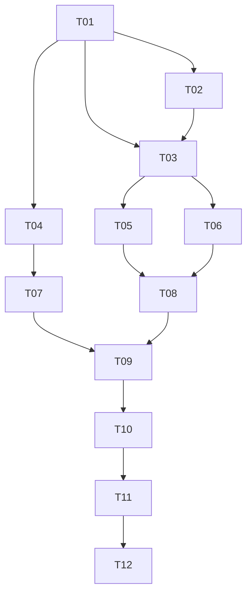

# Stunning Engine Project Plan

This document outlines the comprehensive plan for developing the Stunning Engine, a custom-trained, state-of-the-art image generation and editing system optimized exclusively for Apple Silicon M4 hardware. The project follows a structured approach with clearly defined tasks, expert role assignments, and a precise handoff sequence to ensure efficient development and high-quality results.

## Project Overview

The Stunning Engine is designed to excel in fashion, editorial, hair styling, and candid photography applications, all while running exclusively on local Apple Silicon M4 hardware with 16 GB RAM or greater. This project plan serves as the central coordination document for all contributors, ensuring that each component is developed with the M4-first mandate in mind.

## Ground Truth Workflow

This repository follows a "ground truth" workflow model:

1. **Single Writer, Multiple Readers**: All AIs and human contributors will read from this repository to understand requirements, specifications, and current progress. However, only Manus (the project orchestrator) will write directly to the repository.

2. **Contribution Process**: 
   - Expert AIs and human contributors review task requirements from the repository
   - They develop their assigned components independently
   - All outputs are submitted to Manus
   - Manus validates, integrates, and commits the contributions to maintain consistency

3. **Version Control**: The repository serves as the single source of truth for the project, with all changes tracked and documented through the Git version control system.

4. **Coordination**: The task breakdown and handoff sequence (detailed below) ensures that dependencies are respected and that each contributor receives the necessary inputs for their assigned tasks.

## Subtasks, IDs, and Assigned Experts

The following table outlines all project tasks, their assigned experts, and the handoff sequence:

| Task ID | Task Name / Description | Assigned Expert | Handoff To |
|---------|-------------------------|-----------------|------------|
| T01 | Project Setup & Repo Bootstrapping | Manus (Project Owner) | T02, T03, T04 |
| T02 | Model & Adapter Ecosystem Research (M4-only) | Research AI (Claude/Perplexity) | T03 |
| T03 | Environment Setup (Apple Silicon, MPS) | Infra AI (Claude/ChatGPT) | T05, T06 |
| T04 | Data Pipeline Design (Local-Optimized) | Data Architect (Claude/ChatGPT) | T07 |
| T05 | Dataset Curation, Augmentation, and Manifest | Data Ops AI (Claude/ChatGPT) | T08 |
| T06 | Legal & Rights Vetting for Datasets | Compliance AI (Claude/ChatGPT) | T08 |
| T07 | PEFT & Token Training Pipeline (LoRA/Textual Inv.) | Training AI (Claude/Manus) | T09 |
| T08 | Adapter/Model Merge & Quantization (for M4) | Training AI (Claude/Manus) | T09 |
| T09 | Validation, Testing, and Baseline Comparison | Validator AI (Claude/OAI 4.1) | T10 |
| T10 | Backend/Integration & Deployment Scripting (M4) | Manus (DevOps) | T11 |
| T11 | Documentation & Handoff for Upgrades | Docs AI (Claude/ChatGPT) | User (You) |
| T12 | User Tasks: Data Sourcing, Annotation, Validation | User (You) | T05, T09 |

## Task Flow / Handoff Diagram

The following diagram illustrates the task dependencies and handoff sequence:

The handoff sequence can be summarized as follows:
1. T01 → T02, T03, T04
2. T02 → T03
3. T03 → T05, T06
4. T04 → T07
5. T05, T06 → T08
6. T07, T08 → T09
7. T09 → T10
8. T10 → T11
9. T11 → T12
10. T12 (User) provides initial feedback and/or data for future cycles.

## Special Task: Genspark Image Download Jobs

The following tasks are assigned to Genspark via its "download for me" feature:

### Genspark Task 1: Anchor Model Reference Photos
- **Objective**: Download 50–100 high-resolution, natural-light, neutral-pose images for each of 5 "anchor" characters, spanning diverse ages, genders, and hair types, suitable for training identity-preserving tokens.
- **Output**: Organize as `/genspark/anchors/{model_name}/img_###.jpg`

### Genspark Task 2: Editorial/Fashion Scenes
- **Objective**: Download 100–200 editorial/fashion images featuring varied backgrounds, scene lighting, and full-body poses, focusing on high quality and diverse settings (indoor studio, urban street, salon interior).
- **Output**: `/genspark/editorial/scene_###.jpg`

### Genspark Task 3: "In Situ" Candid Reference Set
- **Objective**: Download 50–100 candid-style, "in action" images (e.g., model blowing out candles, laughing, using a mirror, hands with scissors, entering a taxi) representing natural, spontaneous moments for candid prompt adapters.
- **Output**: `/genspark/candid/candid_###.jpg`

**Instructions**:
- Genspark should download and store images in the specified subfolders.
- Either share a download link to Manus or notify the user for manual upload into the repo's `/data/` folder.

## Task Descriptions

### T01: Project Setup & Repo Bootstrapping
This initial task involves setting up the GitHub repository structure, creating documentation templates, and establishing the project framework. This includes defining folder structures, creating README and PROJECT_PLAN documents, and setting up placeholder files for all subsequent tasks.

### T02: Model & Adapter Ecosystem Research (M4-only)
This research phase focuses on identifying state-of-the-art image generation models and techniques that can be effectively adapted for Apple Silicon M4 hardware. The research will evaluate various architectures, optimization approaches, and existing solutions, with particular attention to memory efficiency and MPS compatibility.

### T03: Environment Setup (Apple Silicon, MPS)
This task involves creating a comprehensive development environment optimized for Apple Silicon, including all necessary frameworks, libraries, and tools. The environment will be specifically configured to leverage Metal Performance Shaders (MPS) and other M4-specific optimizations.

### T04: Data Pipeline Design (Local-Optimized)
This task focuses on designing efficient data processing workflows that can handle image datasets within the memory constraints of M4 hardware. This includes strategies for data loading, preprocessing, augmentation, and batching that are optimized for local execution.

### T05: Dataset Curation, Augmentation, and Manifest
This task involves selecting, preparing, and organizing high-quality training data focused on fashion, editorial, hair styling, and candid photography domains. This includes data cleaning, annotation, and augmentation to ensure the resulting model excels in the target application areas.

### T06: Legal & Rights Vetting for Datasets
This task ensures that all training data complies with legal requirements and usage rights. This includes verifying licenses, permissions, and copyright status for all images used in the training process.

### T07: PEFT & Token Training Pipeline (LoRA/Textual Inv.)
This task involves developing and implementing Parameter-Efficient Fine-Tuning (PEFT) methods, including LoRA (Low-Rank Adaptation) and Textual Inversion techniques, optimized for M4 hardware. This includes creating custom training loops and memory-efficient backpropagation strategies.

### T08: Adapter/Model Merge & Quantization (for M4)
This task focuses on creating specialized adapters and model compression techniques that enable state-of-the-art performance while maintaining compatibility with M4 memory constraints. This includes weight merging strategies and quantization approaches specifically designed for Metal execution.

### T09: Validation, Testing, and Baseline Comparison
This task involves comprehensive evaluation of model performance across various metrics and real-world use cases, with particular attention to quality, speed, and memory usage on M4 hardware. This includes comparing results against established baselines to ensure competitive performance.

### T10: Backend/Integration & Deployment Scripting (M4)
This task involves developing a streamlined, efficient backend system that provides intuitive access to the engine's capabilities while maintaining optimal performance on M4 hardware. This includes API design, resource management, and integration with common creative workflows.

### T11: Documentation & Handoff for Upgrades
This task focuses on creating detailed, comprehensive documentation covering all aspects of the system, from theoretical foundations to practical usage guidelines. This ensures that users can effectively leverage the engine's capabilities while understanding its design principles and limitations.

### T12: User Tasks: Data Sourcing, Annotation, Validation
This ongoing task involves user participation in data sourcing, annotation, and validation activities. This includes providing feedback on model outputs, contributing additional training data, and validating results in real-world scenarios.

## Repository Structure

The repository is organized into the following main directories:

- `/docs/`: Documentation files, including technical specifications, user guides, and API references
- `/data/`: Data processing scripts, dataset manifests, and sample data (excluding large datasets)
- `/training/`: Training scripts, configuration files, and checkpointing utilities
- `/backend/`: Backend implementation, API definitions, and integration utilities
- `/validation/`: Validation scripts, metrics definitions, and benchmark tools
- `/models/`: Model definitions, adapter configurations, and quantization utilities

Each directory contains placeholder files and subdirectories corresponding to specific tasks in the project plan, ensuring that all contributors can easily locate relevant resources and understand their responsibilities.

## Contribution Guidelines

All contributions to this project must adhere to the following guidelines:

1. **M4-First Development**: All code, models, and utilities must be optimized for Apple Silicon M4 hardware with 16 GB RAM or greater.
2. **Local-Only Processing**: No cloud computing or external GPU resources may be used at any stage of development or deployment.
3. **Documentation**: All contributions must include comprehensive documentation explaining implementation details, usage instructions, and performance characteristics.
4. **Testing**: All components must be thoroughly tested on M4 hardware to verify performance, memory usage, and compatibility.
5. **Handoff Process**: All completed tasks must follow the handoff sequence outlined in this document, ensuring that dependencies are respected and that each contributor receives the necessary inputs.

## Project Timeline and Milestones

The project will proceed according to the task flow outlined above, with regular progress updates and milestone reviews. Specific deadlines and milestones will be established as the project progresses, with particular attention to the following key deliverables:

1. **Environment and Pipeline Setup**: Completion of tasks T01-T04
2. **Dataset Preparation and Training Infrastructure**: Completion of tasks T05-T07
3. **Model Training and Optimization**: Completion of task T08
4. **Validation and Backend Integration**: Completion of tasks T09-T10
5. **Documentation and User Handoff**: Completion of task T11

## Conclusion

This project plan provides a comprehensive framework for developing the Stunning Engine, ensuring that all contributors understand their roles, responsibilities, and the overall project structure. By following this plan and adhering to the M4-first mandate, we will create a powerful, locally-run image generation engine that delivers professional-quality results for fashion, editorial, hair styling, and candid photography applications.
