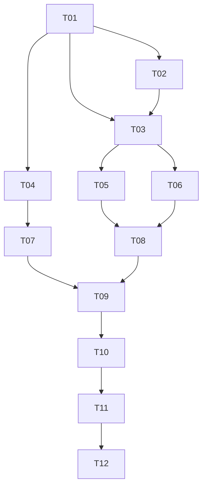

# Stunning Engine Project Plan

This document outlines the comprehensive plan for developing the Stunning Engine, a custom-trained, state-of-the-art image generation and editing system optimized exclusively for Apple Silicon M4 hardware. The project follows a structured approach with clearly defined tasks, expert role assignments, and a precise handoff sequence to ensure efficient development and high-quality results.

## Project Overview

The Stunning Engine is designed to excel in fashion, editorial, hair styling, and candid photography applications, all while running exclusively on local Apple Silicon M4 hardware with 16 GB RAM or greater. This project plan serves as the central coordination document for all contributors, ensuring that each component is developed with the M4-first mandate in mind.

## Ground Truth Workflow

This repository follows a "ground truth" workflow model:

1. **Single Writer, Multiple Readers**: All AIs and human contributors will read from this repository to understand requirements, specifications, and current progress. However, only Manus (the project orchestrator) will write directly to the repository.

2. **Contribution Process**: 
   - Expert AIs and human contributors review task requirements from the repository
   - They develop their assigned components independently
   - All outputs are submitted to Manus
   - Manus validates, integrates, and commits the contributions to maintain consistency

3. **Version Control**: The repository serves as the single source of truth for the project, with all changes tracked and documented through the Git version control system.

4. **Coordination**: The task breakdown and handoff sequence (detailed below) ensures that dependencies are respected and that each contributor receives the necessary inputs for their assigned tasks.

## Subtasks, IDs, and Assigned Experts

The following table outlines all project tasks, their assigned experts, and the handoff sequence:

| Task ID | Task Name / Description | Assigned Expert | Handoff To |
|---------|-------------------------|-----------------|------------|
| T01 | Project Setup & Repo Bootstrapping | Manus (Project Owner) | T02, T03, T04 |
| T02 | Model & Adapter Ecosystem Research (M4-only) | Research AI (Claude/Perplexity) | T03 |
| T03 | Environment Setup (Apple Silicon, MPS) | Infra AI (Claude/ChatGPT) | T05, T06 |
| T04 | Data Pipeline Design (Local-Optimized) | Data Architect (Claude/ChatGPT) | T07 |
| T05 | Dataset Curation, Augmentation, and Manifest | Data Ops AI (Claude/ChatGPT) | T08 |
| T06 | Legal & Rights Vetting for Datasets | Compliance AI (Claude/ChatGPT) | T08 |
| T07 | PEFT & Token Training Pipeline (LoRA/Textual Inv.) | Training AI (Claude/Manus) | T09 |
| T08 | Adapter/Model Merge & Quantization (for M4) | Training AI (Claude/Manus) | T09 |
| T09 | Validation, Testing, and Baseline Comparison | Validator AI (Claude/OAI 4.1) | T10 |
| T10 | Backend/Integration & Deployment Scripting (M4) | Manus (DevOps) | T11 |
| T11 | Documentation & Handoff for Upgrades | Docs AI (Claude/ChatGPT) | User (You) |
| T12 | User Tasks: Data Sourcing, Annotation, Validation | User (You) | T05, T09 |

## Task Flow / Handoff Diagram

The following diagram illustrates the task dependencies and handoff sequence:

The handoff sequence can be summarized as follows:
1. T01 → T02, T03, T04
2. T02 → T03
3. T03 → T05, T06
4. T04 → T07
5. T05, T06 → T08
6. T07, T08 → T09
7. T09 → T10
8. T10 → T11
9. T11 → T12
10. T12 (User) provides initial feedback and/or data for future cycles.

## Detailed Task Specifications

### Genspark Image Collection Tasks

#### GS-T1-Genspark
- **Expert**: Genspark
- **Goal**: Download 50–100 high-resolution, natural-light, neutral-pose images for each of 5 "anchor" characters (varied age, gender, hair type) for identity token training.
- **Return Format**:
  - All images in `/tasks/GS-T1/output/anchors/{model_name}/img_###.jpg`
  - A manifest.csv with columns: model_name, gender, age, file_name, source_url
- **Warnings**:
  - No duplicate or low-res images.
  - Ensure all images are public domain or have valid reuse licenses.
- **Context**: This is part of building a SOTA custom image model (Stunning Engine) for the hair/fashion/editorial domain, M4-optimized. Deliver output in the above structure for Manus and downstream Data Ops AI.

#### GS-T2-Genspark
- **Expert**: Genspark
- **Goal**: Download 100–200 high-quality editorial/fashion images covering diverse scenes and poses for training style and context adapters.
- **Return Format**:
  - All images in `/tasks/GS-T2/output/editorial/scene_###.jpg`
  - A manifest.csv with: scene_type, location (if available), gender, pose, file_name, source_url
- **Warnings**:
  - Avoid watermarked or low-res images.
  - Images must be cleared for reuse or transformation.
- **Context**: These images will anchor our system's adaptability to new client brands and contexts. Organized output enables rapid integration for token and adapter training.

#### GS-T3-Genspark
- **Expert**: Genspark
- **Goal**: Download 50–100 candid, 'in action' reference images for 'surprise me' and candid adapter training (e.g., blowing candles, candid smiles, mirror shots, hands with tools, stepping into taxis).
- **Return Format**:
  - All images in `/tasks/GS-T3/output/candid/candid_###.jpg`
  - A manifest.csv with: scenario, model demographics, file_name, source_url
- **Warnings**:
  - Only real, natural moments. No staged or AI-generated fakes.
  - Full compliance with rights for dataset inclusion.
- **Context**: Candid data boosts model realism and emotional versatility for downstream clients. All outputs will feed into prompt engineering and validation workflows.

### Core Project Tasks

#### T01_Manus
- **Expert**: Manus
- **Goal**: Bootstrap the 'stunning-engine' repo with the prescribed folder structure, top-level README, and placeholder tasks (GS-T1…T3, T01–T12).
- **Return Format**:
  - All folders/files as specified in the project plan.
  - README.md summarizing the project, workflow, and M4-first local focus.
  - A top-level /tasks directory, each subfolder containing prompt.json for the assigned expert.
- **Warnings**:
  - Do not proceed until Genspark reference images are being gathered.
  - Ensure Apache 2.0 license and documentation are present.
- **Context**: This repo is ground truth and all experts read from it. Only Manus writes to the repo. All deliverables for subsequent tasks are organized by task ID.

#### T02_Claude_Sonnet
- **Expert**: Claude Sonnet 4
- **Goal**: Survey and compare SOTA, M4-compatible image models (SD3 Medium, Bagel, Janus Pro 7B, FLUX.1 VAE), LoRA and textual inversion adapters for performance, fidelity, and local training/serving on Apple Silicon.
- **Return Format**:
  - A comparison table in `/tasks/T02/output/model_survey.md`
  - Shortlist of recommended models/adapters with supporting links.
- **Warnings**:
  - Only include models/tech that can be trained and served efficiently on a 16GB M4.
  - Highlight any legal/license considerations.
- **Context**: This research defines all downstream architecture and adapter design for Stunning Engine. Results will be referenced by all subsequent tasks.

#### T03_Gemini2.5
- **Expert**: Gemini 2.5+
- **Goal**: Script and document the complete M4/MPS local environment setup, including PyTorch, Diffusers, bitsandbytes, and LoRA/textual inversion tooling.
- **Return Format**:
  - install.sh and requirements.txt in `/tasks/T03/output/`
  - README.md step-by-step install guide (tested on M4, 16GB+).
- **Warnings**:
  - Do not include packages that break on MPS.
  - Validate all install commands on current macOS.
- **Context**: The goal is zero-hassle, reproducible setup for all project contributors. This environment is foundation for training, inference, and validation.

#### T04_Claude_Opus
- **Expert**: Claude Opus 4
- **Goal**: Design and document the full data pipeline schema, annotation/manifest standards, and local storage conventions for all training data, adapters, and checkpoints.
- **Return Format**:
  - A schema.yaml and example manifest.csv in `/tasks/T04/output/`
  - PIPELINE.md with end-to-end data flow and folder structure.
- **Warnings**:
  - Keep formats human- and machine-readable.
  - Accommodate extensibility for new clients/scenes/models.
- **Context**: This schema ensures all training, validation, and future expansion tasks are frictionless and well-documented.

#### T05_Claude_Sonnet
- **Expert**: Claude Sonnet 4
- **Goal**: Curate, augment, and organize all source images from Genspark tasks and any user-uploaded photos into the required data structure for training (512×512, properly tagged). Generate manifest files for each subset.
- **Return Format**:
  - Augmented/processed images in `/tasks/T05/output/{anchor|editorial|candid}/`
  - manifest.csv for each category: file_name, category, tags, source, any labels
- **Warnings**:
  - No duplicate, corrupt, or mislabeled images.
  - Maintain exact folder and manifest structure for compatibility.
- **Context**: Data must be clean, tagged, and balanced for optimal LoRA/textual inversion training. This output is the direct input for adapter/token pipelines.

#### T06_Claude_Opus
- **Expert**: Claude Opus 4
- **Goal**: Audit all curated/augmented images and manifests for copyright, license compliance, and consent (if needed). Flag or quarantine any image or set with incomplete or ambiguous rights.
- **Return Format**:
  - compliance_report.md and flagged_images.csv in `/tasks/T06/output/`
- **Warnings**:
  - Missing or ambiguous rights = quarantine until resolved.
  - Summarize license type per data source.
- **Context**: No data may move to training or deployment unless verified legal for open-source, commercial, or internal use as required.

#### T07_Manus
- **Expert**: Manus
- **Goal**: Build and execute PEFT (parameter-efficient fine-tuning) pipelines: train LoRA adapters (editorial, candid, style), run textual inversion for each anchor token (<Julie>, etc.), save checkpoints for each step.
- **Return Format**:
  - LoRA and TI checkpoints in `/tasks/T07/output/adapters/`
  - training_log.md with steps, epochs, validation images
- **Warnings**:
  - All runs must fit within M4 16GB RAM, batch size=1 if needed.
  - Do not proceed if data from T06 is not fully cleared.
- **Context**: PEFT adapters and tokens are the 'secret sauce'—outputs feed directly to model merge and integration.

#### T08_Claude_Sonnet
- **Expert**: Claude Sonnet 4
- **Goal**: Merge LoRA and TI adapters into the core SD3 Medium backbone. Quantize the final model (4-bit, GGUF or best M4 format) and document performance/compatibility.
- **Return Format**:
  - Final model checkpoint(s) in `/tasks/T08/output/models/`
  - integration_notes.md with details on merge/quant process and compatibility
- **Warnings**:
  - Output checkpoint must run inference on M4 with <12GB RAM.
  - Keep a copy of pre-quantized model for backup.
- **Context**: Final merged model is deployed for all image generation and downstream use. Quantization is critical for resource efficiency.

#### T09_OAI_4.1
- **Expert**: OpenAI GPT-4.1
- **Goal**: Validate the merged/quantized model with baseline and real-world test prompts. Compare sample outputs against prior checkpoints (SD3, Bagel, Janus Pro) and log findings.
- **Return Format**:
  - validation_report.md in `/tasks/T09/output/`
  - Test images in `/tasks/T09/output/validation/`
- **Warnings**:
  - All comparisons must be done using prompts relevant to project use-cases.
  - Document strengths and weaknesses, include at least 3 images per test.
- **Context**: Ensures model improvements are tangible and reproducible before deployment to production endpoints.

#### T10_Manus
- **Expert**: Manus
- **Goal**: Integrate final model into backend API. Add endpoints for generation, adapter selection, prompt preview, and batch rendering—all M4-optimized.
- **Return Format**:
  - Code/scripts in `/tasks/T10/output/backend/`
  - api_docs.md summarizing endpoint usage, parameters, and example calls
- **Warnings**:
  - Endpoints must work on M4 with no external dependencies.
  - Document all environment variables and run instructions.
- **Context**: Backend is the production interface for all user-facing tools and clients. Endpoint clarity is crucial for future integrations.

#### T11_Claude_Opus
- **Expert**: Claude Opus 4
- **Goal**: Document every step, config, model, and workflow used in the repo as a human-readable, versioned knowledge base. Prepare quickstart and upgrade guides.
- **Return Format**:
  - Complete docs in `/tasks/T11/output/docs/`
  - quickstart.md and upgrade.md as primary entrypoints
- **Warnings**:
  - Docs must be understandable by both technical and non-technical users.
  - Ensure all code, models, and endpoints are referenced.
- **Context**: Documentation is the single source of truth for onboarding, operation, and future upgrades of the Stunning Engine.

#### T12_Tony
- **Expert**: Tony (You)
- **Goal**: Review, validate, and sign off on all deliverables. Provide feedback, raise issues, and request changes as needed.
- **Return Format**:
  - validation_feedback.md in `/tasks/T12/output/`
- **Warnings**:
  - All outputs must meet original project objective and functional standards.
  - Do not close project until all validation tasks are complete.
- **Context**: Your feedback is the final gate before production deployment or upgrade. Sign-off is required for completion.

## Repository Structure

The repository is organized into the following main directories:

- `/docs/`: Documentation files, including technical specifications, user guides, and API references
- `/data/`: Data processing scripts, dataset manifests, and sample data (excluding large datasets)
- `/training/`: Training scripts, configuration files, and checkpointing utilities
- `/backend/`: Backend implementation, API definitions, and integration utilities
- `/validation/`: Validation scripts, metrics definitions, and benchmark tools
- `/models/`: Model definitions, adapter configurations, and quantization utilities
- `/tasks/`: Task-specific directories containing prompt specifications, input data, and output deliverables

Each directory contains placeholder files and subdirectories corresponding to specific tasks in the project plan, ensuring that all contributors can easily locate relevant resources and understand their responsibilities.

## Contribution Guidelines

All contributions to this project must adhere to the following guidelines:

1. **M4-First Development**: All code, models, and utilities must be optimized for Apple Silicon M4 hardware with 16 GB RAM or greater.
2. **Local-Only Processing**: No cloud computing or external GPU resources may be used at any stage of development or deployment.
3. **Documentation**: All contributions must include comprehensive documentation explaining implementation details, usage instructions, and performance characteristics.
4. **Testing**: All components must be thoroughly tested on M4 hardware to verify performance, memory usage, and compatibility.
5. **Handoff Process**: All completed tasks must follow the handoff sequence outlined in this document, ensuring that dependencies are respected and that each contributor receives the necessary inputs.

## Project Timeline and Milestones

The project will proceed according to the task flow outlined above, with regular progress updates and milestone reviews. Specific deadlines and milestones will be established as the project progresses, with particular attention to the following key deliverables:

1. **Environment and Pipeline Setup**: Completion of tasks T01-T04
2. **Dataset Preparation and Training Infrastructure**: Completion of tasks T05-T07
3. **Model Training and Optimization**: Completion of task T08
4. **Validation and Backend Integration**: Completion of tasks T09-T10
5. **Documentation and User Handoff**: Completion of task T11

## Conclusion

This project plan provides a comprehensive framework for developing the Stunning Engine, ensuring that all contributors understand their roles, responsibilities, and the overall project structure. By following this plan and adhering to the M4-first mandate, we will create a powerful, locally-run image generation engine that delivers professional-quality results for fashion, editorial, hair styling, and candid photography applications.
